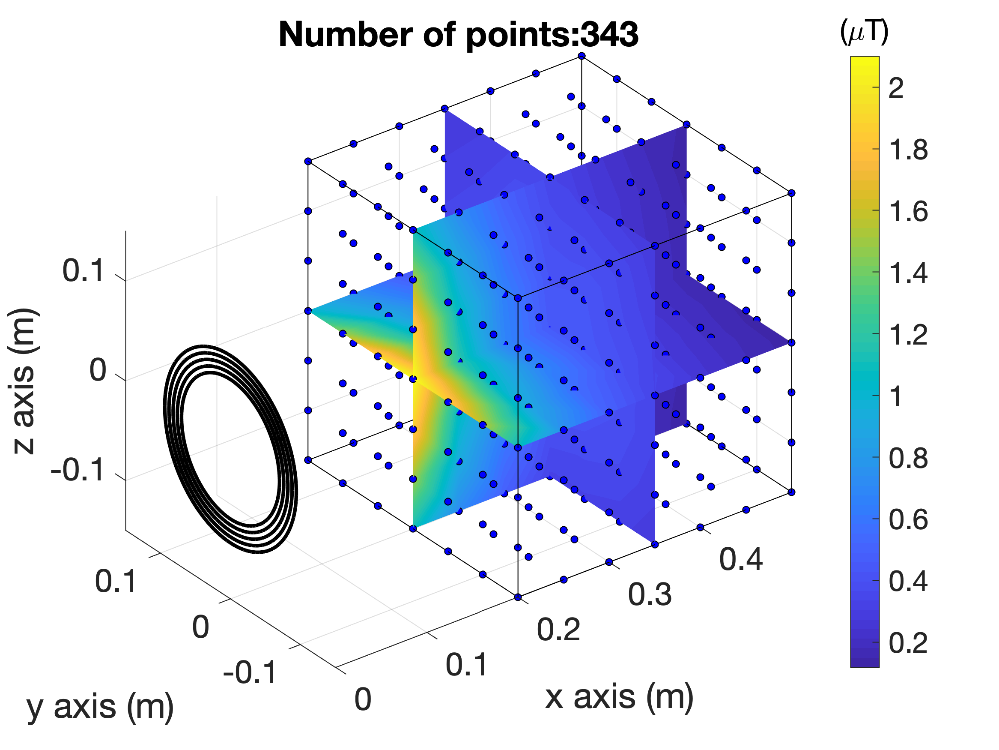
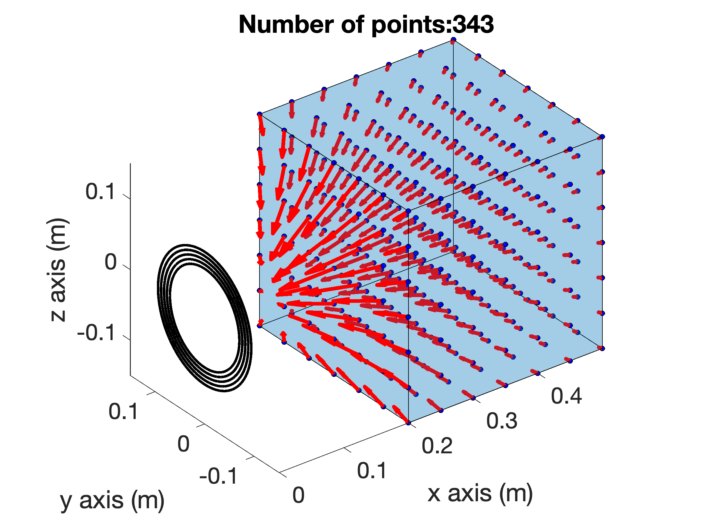
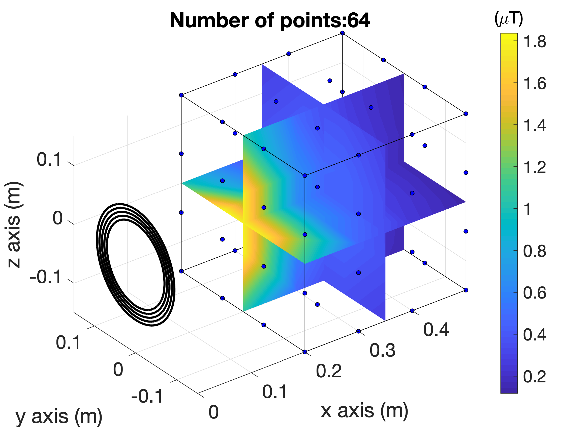
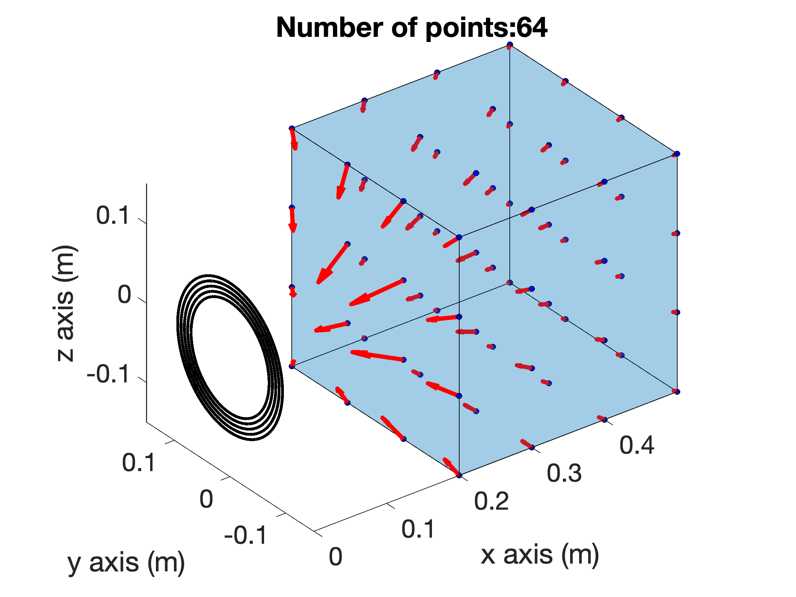

# Bfield_measured
This repository includes the magnetic flux density measured close to a simple coil source (description of the source in the next section).

These data have been registered for research purposes. They are related to the following work presented at [CEFC 2018](http://www.cefc2018.org/):

Alice Conchin Gubernati, Fabio Freschi, Luca Giaccone, Tommaso Campi, Valerio De Santis and Ilkka Laakso, *"Comparison of numerical techniques for the evaluation of human exposure from measurement data
"*

Other information:

* The paper has been awarder with the best poster award
* The paper is under revew for possible publication on *IEEE Transactions on Magnetics* (currently it is at step R1)

## Description of the magnetic field source

A 5-turn coil with inner radius of 70 mm and wire radius of 3 mm is located 200 mm away from a square box. The side of the box is 300 mm. Each wire carries 1 A and the operating frequency is 1 kHz. The center of the coil corresponds to the origin of the reference system and the axis of the coil is the x-axis.

## Repository content

* `Bmeasured_343_points.txt` : text file including the measurements at 343 points equally spced inside the instection volume. The file include a legend to understand the data meaning.
* `Bmeasured_64_points.txt` : text file including the measurements at 64 points equally spaced inside the instection volume. The file include a legend to understand the data meaning. (These data are obtained by undersampling the original 343 measurements).
* `plot_field.m` : for convenience of the MATLAB&reg; users, this script reads and visualises the data
* `coil_geometry.mat`: MATLAB&reg; file including the geometry of the coil. This file is used in the script `plot_field.m`. If you do not use this script, you do not need this file.

## Ouput of `plot_field.m`

&nbsp;&nbsp;&nbsp;

<b>Fig. 1</b> **Case with 343 points**: magnitude of the field on three cut planes (left) representation of the vector field  (right)

&nbsp;&nbsp;&nbsp;

<b>Fig. 2</b> **Case with 64 points**: magnitude of the field on three cut planes (left) representation of the vector field  (right)

